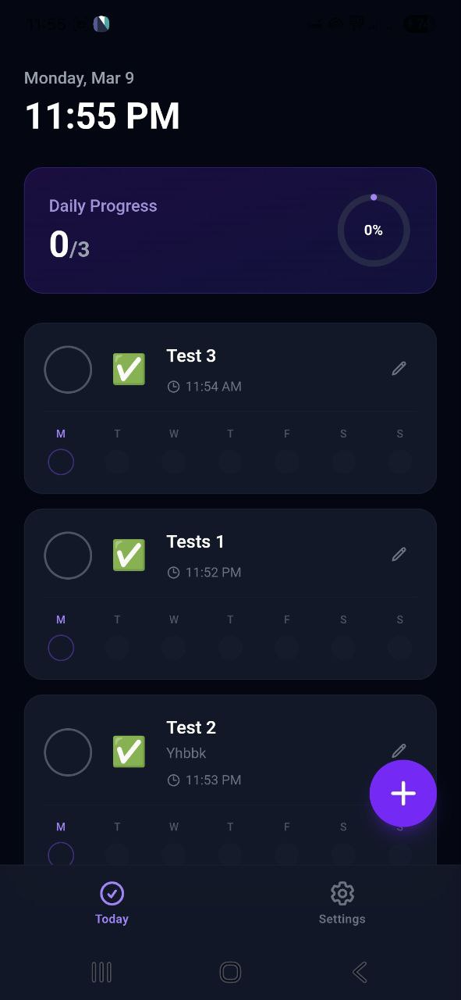
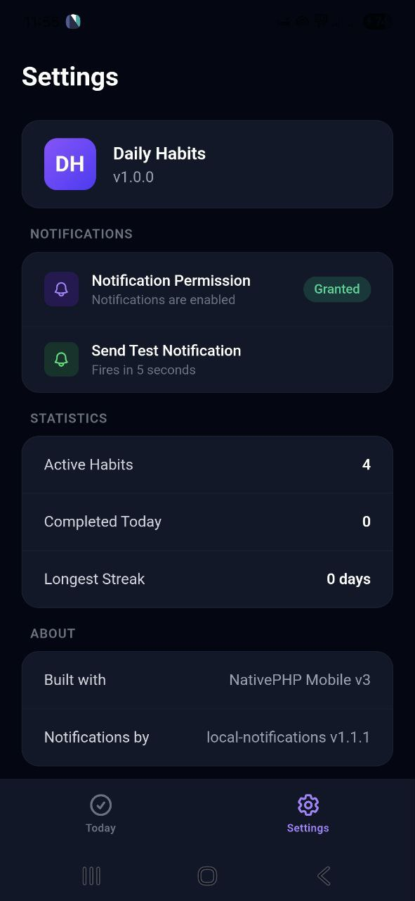

# Daily Habits

[](https://github.com/Ikromjon1998/daily-habits/actions/workflows/ci.yml)
[](LICENSE)

A mobile daily habits tracker built with Laravel, Livewire, and NativePHP Mobile. Runs natively on Android and iOS — no server required, everything works offline.

This project is open source and serves as a real-world example of building a native mobile app with the Laravel/PHP ecosystem, including how to integrate NativePHP Mobile plugins like local notifications.

## Screenshots

<p align="center">
  
  &nbsp;&nbsp;
  
</p>

## Features

- Create daily habits with emoji icons and reminder times
- Native push notifications with daily repeating reminders
- Mark habits complete directly from notification action buttons
- Track completion streaks and weekly progress
- Dark theme optimized for mobile
- Works completely offline — SQLite database, no API, no authentication

## Tech Stack

- **PHP 8.4** / **Laravel 12** / **Livewire 4**
- **NativePHP Mobile v3** — native Android & iOS builds from a single Laravel codebase
- **Tailwind CSS 4** — dark theme with safe area inset support
- **SQLite** — local on-device database
- [`ikromjon/nativephp-mobile-local-notifications`](https://github.com/Ikromjon1998/nativephp-mobile-local-notifications) v1.2.0 — local notification scheduling with repeating intervals, action buttons, and rich content

## NativePHP Plugin Example

This app demonstrates how to integrate a NativePHP Mobile plugin. The local notifications plugin is registered in the service provider and used throughout the app:

```php
// app/Providers/NativeServiceProvider.php
use Native\Mobile\Facades\System;

public function boot(): void
{
    System::enablePlugins([
        \Ikromjon\LocalNotifications\LocalNotificationsServiceProvider::class,
    ]);
}
```

```php
// Scheduling a daily repeating notification
use Ikromjon\LocalNotifications\Facades\LocalNotifications;
use Ikromjon\LocalNotifications\Enums\RepeatInterval;

LocalNotifications::schedule([
    'id' => 'habit-1',
    'title' => 'Time to Meditate',
    'body' => 'Your 10-minute session is waiting',
    'at' => now()->setTime(7, 0)->timestamp,
    'repeat' => RepeatInterval::Daily,
    'sound' => true,
    'actions' => [
        ['id' => 'done', 'title' => 'Done'],
        ['id' => 'snooze', 'title' => 'Snooze'],
    ],
]);
```

## Installation

```bash
git clone https://github.com/Ikromjon1998/daily-habits.git
cd daily-habits
composer install && npm install
cp .env.example .env
php artisan key:generate
php artisan migrate --seed
npm run build
```

## Running

**On device (native build):**

```bash
php artisan native:run android
# or
php artisan native:run ios
```

> Notifications require a native build — they do not work with `php artisan native:jump`.

**For local development:**

```bash
composer run dev
```

## Quality Gates

```bash
composer lint          # Format with Pint
composer analyse       # PHPStan level 8
composer rector:check  # Rector dry-run
composer test          # Run test suite
```

## Project Structure

```
app/
  Livewire/          Today.php, Settings.php, HabitForm.php
  Models/            Habit.php, HabitCompletion.php
  Services/          HabitNotificationService.php
  Providers/         NativeServiceProvider.php
resources/
  css/app.css        Tailwind @theme + custom animations
  views/
    layouts/         Base layout with bottom nav and safe areas
    livewire/        Component views
plan/                Epic documents (development roadmap)
```

## Requirements

- PHP 8.3+
- Node.js 18+
- NativePHP Mobile v3+
- Android API 33+ / iOS 18.2+

## Contributing

Contributions are welcome! Whether it's a bug fix, new feature, or improvement — feel free to open an issue or submit a pull request. Please read [CONTRIBUTING.md](CONTRIBUTING.md) before getting started.

If you'd like to use this project as a starting point for your own app, feel free to fork it.

## License

MIT
